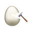

# GRANTURISMO



[![NPM Version][npm-version-image]][npm-url]
[![NPM Downloads][npm-downloads-image]][npm-url]
[![MIT License][license-image]][license-url]
[![Standard Version][standard-version-image]][standard-version-url]

Generator Tool

Workflow tool for scaffolding projects.

The streaming scaffold system.

It is easy to learn and easy to use, more efficient.

If you want to use a scaffold, the scaffold should be adapted to gt, but it is much more simpler than [yeoman](http://yeoman.io/).

## SCAFFOLDS

- [vivaxy/react-scaffold](https://github.com/vivaxy/react-scaffold) react, redux, router...
- [vivaxy/front-end-scaffold](https://github.com/vivaxy/front-end-scaffold) eslint...

## INSTALLATION

`sudo npm i -g granturismo`

## USAGE

`gt`

`gt help`

`gt init`

`gt config list`

`gt config add scaffold-name git-repo`

`gt config remove scaffold-name`

## HOW TO SCAFFOLD USING GT?

Implement `scripts/gt.js`, adding project info into user config.

See [react-scaffold](https://github.com/vivaxy/react-scaffold) as example.

### gt.js

GT cli invokes `init` method in `scaffold/scripts/gt.js`, and passing options into `init`.

```js
{
    project: {
        folder: '/absolute/path/to/project/folder',
        name: 'project-name', // same as project folder name
        git: {
            repositoryURL: 'git://git-url', // mainly used for package.json repository.url
        },
    },
    scaffold: {
        folder: '/absolute/path/to/scaffold/folder', // mostly ~/.gt/scaffold-name
        name: 'scaffold-name',
    },
    presets: {
        copyFiles: () => {},
        writeFile: () => {},
        updateFile: () => {},
        writeJson: () => {},
        updateJson: () => {},
    },
}
```

#### presets

##### copyFiles(fileList)

`fileList` `Array[String]` is an array containing filename your want to copy.

eg.

```
const copyFiles = (options) => {

    const {
        presets,
    } = options;

    const files = [
        `docs`,
        `mock-server`,
        `source`,
        `.babelrc`,
        `.editorconfig`,
        `.gitignore`,
        `LICENSE`,
        `webpack.config.js`,
    ];

    console.log(`copying files...`);
    presets.copyFiles(files);
};
```

##### writeFile({String}, {String})

Write string into file under project folder

##### updateFile({String}, filter{Function})

`filter{Function}` `filter({String}) => {String}`

Read file from scaffold, passing into `filter`, write filter result into file under project folder

##### writeJson({String}, {Object})

Same as `writeFile`, but passing json object into second parameter

##### updateJson({String}, filter{Function})

`filter{Function}` `filter({Object}) => {Object}`

Same as `updateFile`, but passing json object into `filter`

## Contribute

make sure you have submitted your changes

`npm run release`

`gacp; npm publish --registry="https://registry.npmjs.org/"`

## SOME SIMILAR PROJECTS

- [yeoman](http://yeoman.io/)
- [node-scaffold-generator](https://github.com/kaelzhang/node-scaffold-generator)

## ENCOUNTERED PROBLEMS

- npm postinstall scripts running by nobody, cannot write files in file system.

    @see http://stackoverflow.com/questions/25011703/write-file-in-home-directory-when-running-npm-install
    
    when running `gt init`, user is current login user (whoami === 'vivaxy'), whence we can write files.

## REFERENCE

- https://github.com/jprichardson/node-fs-extra
- https://github.com/shelljs/shelljs
- https://github.com/yargs/yargs
- https://github.com/isaacs/minimatch

[npm-version-image]: http://img.shields.io/npm/v/granturismo.svg?style=flat-square
[npm-url]: https://www.npmjs.com/package/granturismo
[npm-downloads-image]: https://img.shields.io/npm/dt/granturismo.svg?style=flat-square
[license-image]: https://img.shields.io/npm/l/granturismo.svg?style=flat-square
[license-url]: LICENSE
[standard-version-image]: https://img.shields.io/badge/release-standard%20version-brightgreen.svg?style=flat-square
[standard-version-url]: https://github.com/conventional-changelog/standard-version
